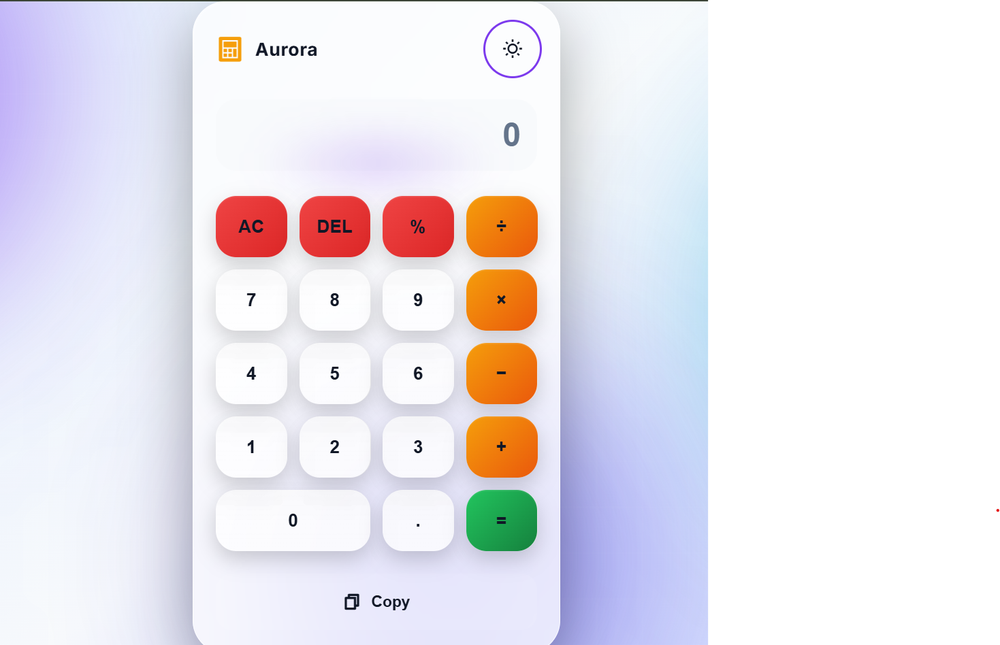
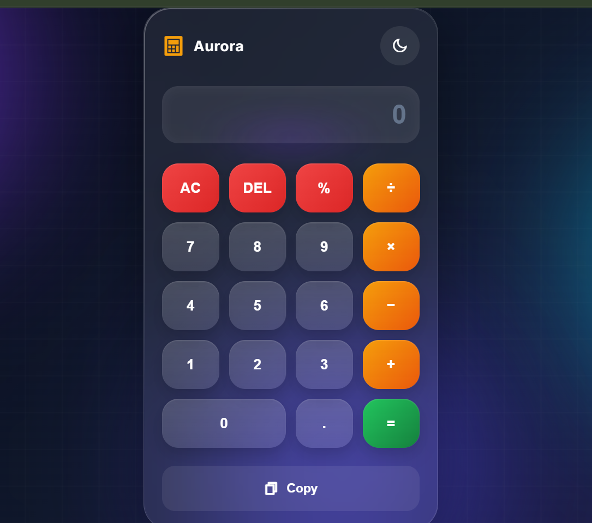

# 🧮 Aurora Calculator

A responsive calculator built using HTML, CSS, and JavaScript.

## 🌐 Live Demo

🔗 https://komaljawliya-tech.github.io/calculator-app/

## 🚀 Features

- Basic arithmetic operations
- Decimal support
- Clear (AC)
- Delete (DEL)
- Keyboard support
- Responsive design
- Modern UI

## 🛠️ Tech Stack

- HTML5
- CSS3
- JavaScript (ES6)

## 📂 Folder Structure

Calculator-app/ 
│── README.md 
│── index.html 
│── style.css 
│── script.js 
│
└── images/ 
 ├── calculator1.png 
 └── calculator2.png

## 📸 Screenshots

### Home Screen

### Dark Mode

## 📖 What I Learned

- HTML structure
- CSS Grid
- JavaScript DOM manipulation
- Event handling
- Responsive design